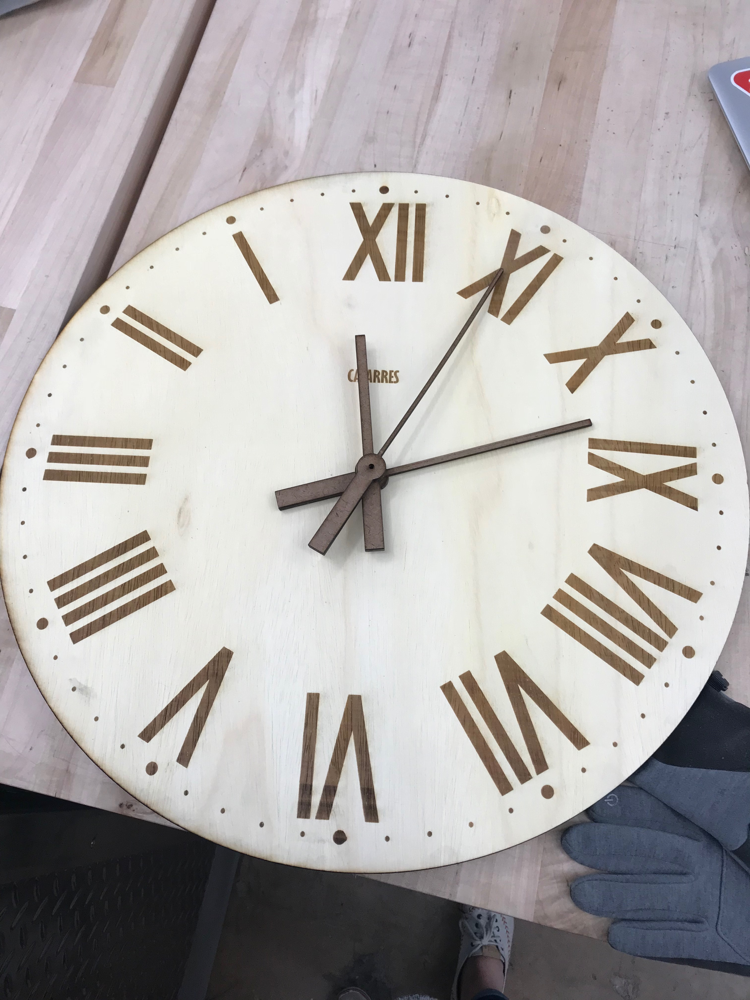

# Final Project - Physical Computing and the Internet of Things

*Name:*  Camila Vargas Restrepo

*Date:* December 14. 2017

*Size:* 53.34 cm × 53.34 cm (21 in × 21 in)

*Medium:* Birch Wood

## Project: Watching

This birch wood clock that runs on a Raspberry Pi is meant to disorient the audience and make them question the concept of time. It's meant to challenge what the clock represents and how it does so. 

### Detailed Project Description

#### WHAT

**The Clock**

The piece is a 53.34 in diameter clock made out of birch wood. The clock movement mechanism was inspired by the [Starchar Clock](http://thewoodenclock.com/downloads/starchar-clock-plans/) designed by Colin Sprinkle. The mechanism was built following the instructions provided by Sprinkle. The clock is equipped with an hour, minute and second hand which are all moved by the wooden gears. The clock moves thanks to a [continuous rotation servo motor](https://www.adafruit.com/product/154) wich is hooked to a [Raspberry Pi Zero](https://www.raspberrypi.org/products/raspberry-pi-zero/). 

The clock has a non traditional face that displays roman numerals that increase counterclockwise . As is used in many clocks for [multiple reasons](http://mentalfloss.com/article/24578/why-do-some-clocks-use-roman-numeral-iiii), the clock uses IIII instead of IV to represent 4. 

Embedded in the clock face is a a small [Raspberry Pi Camera Module](https://www.raspberrypi.org/products/camera-module-v2/) that is used to recognize faces as a proxy for detecting if there is someone looking at the clock.

*Scenarios*
* If someone is looking at the clock, the hands will move counterclockwise. Since the numerals increase counterclockwise, time is moving forward in this scenario. 
* If no one is looking at the clock, the hands will move clockwise. Since the numerals increase counterclockwise, in this scenario time is moving backwards. 
* If someone looks at the clock after a period where no one was looking at the clock, the hands will move fast counterclockwise to recover the time "lost" and then return to seconds pace. 

**The Exhibition Space**

Ideally, the clock hangs on a wall in front of a mirror. The wall angled in a way that allows for the audience first impression of the space to be walking towards the mirror while they see the reflection of the clock's face (See Initial Impression). To some, this should be disorienting since the clock's hands appear to be moving forward in the mirror (assume no one else is  in the space, so no one is looking at the clock). The person should then move towards the clock in order to inspect the space. When they turn around to look at the clock (See Inspection) the camera should detect them and have the hands start moving clockwise.


When the person turns around again to re-inspect the mirror (this should / could happen if the person is confused, which is the whole point of the piece) the camera will stop detecting their faces and will start moving the hands counterclockwise. To the audience member who is now looking back at the mirror, the hands are still moving clockwise (See Re-Inspection). 


#### WHY

*The Clock*

For a very long time clocks have fascinated me. In elementary school, I once pulled my kitchen's clock apart to use the mechanism for an art project. The choice to build an analogue, wooden clock was partly motivated by nostalgia and the realization that times are changing: what used to be a clear representation of time may no longer be so as digital clocks replace analogue ones. 

*The Operationalization of Constructs*

One of the defining characteristics of the information age is our increased capacity to measure and quantify phenomena. We are now able to gather data about almost anything imaginable: from the steps we take to the food we eat, from how long we drive to how many friends you have.

Reality mining was introduced 10 years ago by Alex Pentland in the paper [*Reality Mining: Sensing Complex Social Systems*](http://realitycommons.media.mit.edu/pdfs/realitymining.pdf) The authors' goal was to demonstrate 
>"the ability to use standard Bluetooth-enabled mobile telephones to measure information access and use in different contexts, recognize social patterns in daily user activity, infer relationships, identify socially significant locations, and model organizational rhythms." 

Today, reality mining is not novel or a far fetched idea. Instead, it is something we, as a society, take for granted and seek to exploit. We  are eager to measure and quantify; we crave information and in some scenarios are unnaturally parallized if we don't have data to decide. However, in the end, the number of likes we get is only a proxy for how amiable we are, the number of followers we have on Instagram is only a proxy for how many real friends we have, the steps displayed on our Fitbits are only a proxy for how active we have been (arguably, it's even a proxy for [steps](https://help.fitbit.com/articles/en_US/Help_article/1143)). A central piece of the reality mining puzzle, one that people often forget, is one where we operationalize constructs. Here we simultaneously decide what is the essence of our construct and what the best way to quantify it is. 

Often, however, we forget that this step existed in our minds or in someone elses. The essence, the definition, and the operationalized measurement get blended together. The boundaries between these seem to disappear and we forget that likes are not friendships and that clock tickings are not time. 

*Time*

>“People never seemed to notice that, by saving time, they were losing something else. No one cared to admit that life was becoming ever poorer, bleaker and more monotonous. The ones who felt this most keenly were the children, because no one had time for them any more. But time is life itself, and life resides in the human heart. And the more people saved, the less they had.”* ― Michael Ende, Momo

Momo is a fiction novel by Michael Ende. One day, to the city where Momo lives arrive the Grey Men who present themselves as agents of the Timsavings Bank. They claim that time can be deposited to the bank and be later retrieve it. Yet, the more time people save, the less they have; the time put in the bank is lost forever. 


In the project I wanted to challenge the way we operationalize concepts and how naturalized their representaitons can become. The orientation of the clock's hands have become something so common, so natural (although arguable we are at the end of an era in that sense) that clocks have effaced numbers from their dials. By flipping the face around, my intention was to create a sense of disorientation and make people think hard about the representation of time. 

I think there are several ways to read what the alternating clock mechanism represents. But one of them is that it represents some of the problems around of quantifying time. People in the space will always see the clock's hands moving clockwise, yet what the clock appears to tell you is not what it is telling you. The clock represents time and the mirror represents the representation of time. Time moves forward only because we represent it a certain way. In the clock, looking at the mirror and not the clock is what makes it move counterclockwise (forward). When the audience looks at the clock directly, they may think they are looking at the same concept (since the camera detects the person, clock hands start moving clockwise and they appear the same as in the reflection), but they are not. Now, time is moving backwards. Looking at the concept itself makes it come apart. 

>"Calendars and clocks exist to measure time, but that signifies little because we all know that an hour can seem as eternity or pass in a flash, according to how we spend it."* - Michael Ende, Momo


### Hardware 

* [Raspberry Pi Zero](https://www.raspberrypi.org/products/raspberry-pi-zero/). 
* [continuous rotation servo motor](https://www.adafruit.com/product/154)
* [Raspberry Pi Camera Module](https://www.raspberrypi.org/products/camera-module-v2/)
* [Portable Power Stick](https://getonhand.com/collections/portable-power/products/new-stick-black)

*Hardware Wiring Diagram*


This short video illustrates how the clock was put together
[](https://www.youtube.com/watch?v=ZWfhtFWAcsg)


#### Software

< Explain your code.  You might include code snippets, either `inline` or
```c++
//Multiline
bool photon_fun = TRUE;
```
You should link to your full code, either included in the repository (e.g. [my_code.ino](code/my_code.ino)  or to the Shared Revision in your Particle IDE. >


### Design / Form

Some design choices worth highlighting: 

* Using roman numerals was a design choice that reflected both the nostalgic theme around analogue clocks but also a thoughful decision made thinking about the symmetry of roman numerals and how they would be reflected in the mirror. 
* Using IIII instead of IV was an attempt to follow clock traditions. 
* The decision to hide the gears and present a clean design was meant to keep attention on the main concept (the direction and position of the hands). Yet, I acknowledge that hiding the gears hides the very mechanism that materializes time in the first place. 

### Evaluation / Reflection

This project was an amazing experience for many reasons. Skill-wise, I learned how to use the CNC and the laser cutters. I got to learn and practice how to saw, drill, clamp, glue, sand etc. I learned how to use the Raspberry Pi, how to program a continuous servo (although some parts of this are still unclear) and how to to work with OpenCV to detect faces. I also started exploring multiprocessing in Python (although some parts of this are still unclear). I learned a lot about  gears and gear reductions. I also satisfied a long-held curiosity about how clocks work. Paralleling my piece's conceptual framework, I got to explore, first hand, the mechanism that for centuries has materialized the concept of time. 

Yet, the *process* was the most significant part of this project. Learning required repeated failures and thus it exacted patience, courage and deligence. Building this clock demanded all of my *time* and in the construction process I lost track of it. Again, in parallel to my conceptual framework, the project challenged me to think about time and to spend my time intentionally. Like Beppo, the silent street-cleaner from Momo said:  

>“Sometimes, when you've a very long street ahead of you, you think how terribly long it is and feel sure you'll never get it swept. And then you start to hurry. You work faster and faster and every time you look up there seems to be just as much left to sweep as before, and you try even harder, and you panic, and in the end you're out of breath and have to stop--and still the street stretches away in front of you. That's not the way to do it.

>You must never think of the whole street at once, understand? You must only concentrate on the next step, the next breath, the next stroke of the broom, and the next, and the next. Nothing else.That way you enjoy your work, which is important, because then you make a good job of it. And that's how it ought to be.And all at once, before you know it, you find you've swept the whole street clean, bit by bit. what's more, you aren't out of breath. That's important, too...”  -Michael Ende, Momo


There are specific things that I would have done differently: 
* I would have bought the [servo to shaft coupler](https://www.servocity.com/25-tooth-spline-servo-to-shaft-couplers) in time in order to have less struggles with the servo rotation. 
* I would have cut a longer 5/32 tube for the minute hand (it keeps loosening and rotating with the seconds and not the minutes tube)
* I would have spent more time understanding multiprocessing. 
* I would have dedicated more time to making sure I could exhibit the clock in the mirror space where I intended it to be. 
* I would love to explore different materials like metal or acrylic. 
* I would have liked to pay more attention to the precision of the clock. I would like to access the [time.goc](http://www.time.gov) time data and play with the concept of time being imposed and decided externally to the clock. 