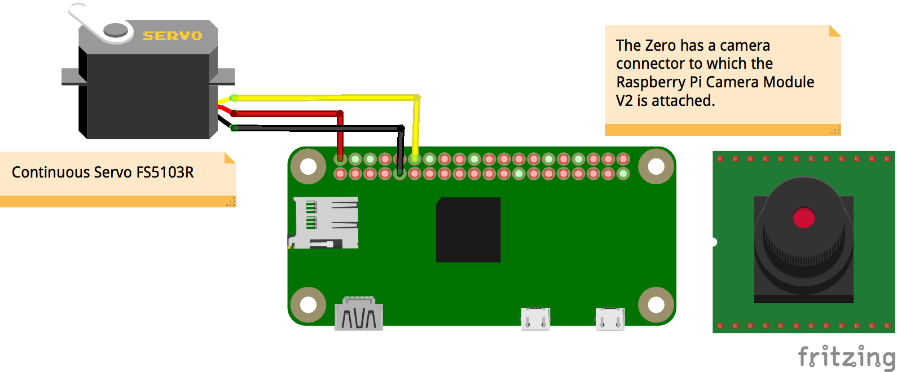

# Final Project - Physical Computing and the Internet of Things

*Name:*  Camila Vargas Restrepo
*Date:* December 14. 2017
*Size:* 53.34 cm × 53.34 cm (21 in × 21 in)
*Medium* Balsa Wood

## Project: Watching

This installation is meant to disorient the audience around the concept of time. 
< 2 - 3 sentence brief description / abstract of your project>

### Detailed Project Description

#### What?

**The Clock**

The piece is a 53.34in diameter clock made out of birch wood. The clock movement mechanism was inspired by the [Starchar Clock](http://thewoodenclock.com/downloads/starchar-clock-plans/) designed by Colin Sprinkle. The mechanism was built following the instructions provided by Sprinkle. The clock is equipped with an hour, minute and second hand which all move thanks to the wood mechanism designed by Sprinkle. The clock moves thanks to a [continuous rotation servo motor](https://www.adafruit.com/product/154) wich is hooked to a [Raspberry Pi Zero](https://www.raspberrypi.org/products/raspberry-pi-zero/). 

The clock has a non traditional face that displays roman numerals that increase counterclockwise ![Clock Face][images/Clock Face.jpg]. As is used in many clocks for [multiple reasons](http://mentalfloss.com/article/24578/why-do-some-clocks-use-roman-numeral-iiii), the clock uses IIII instead of IV to represent 4. 

Embedded in the clock face is a a small [Raspberry Pi Camera Module](https://www.raspberrypi.org/products/camera-module-v2/) that is used to recognize faces as a proxy for detecting if there is someone looking at the clock.

*Scenarios*
* If someone is looking at the clock, the hands will move counterclockwise. Since the numerals increase counterclockwise, time is moving forward in this scenario. 
* If no one is looking at the clock, the hands will move clockwise. Since the numerals increase counterclockwise, in this scenario time is moving backwards. 
* If someone looks at the clock after a period where no one was looking at the clock, the hands will move fast counterclockwise to recover the time "lost" and then return to seconds pace. 

**The Exhibition Space**

Ideally, the clock hangs on a wall in front of a mirror. The wall angled in a way that allows for the audience first impression of the space to be walking towards the mirror while they see the reflection of the clock's face (See Initial Impression). To some, this should be disorienting since the clock's hands appear to be moving forward in the mirror (assume no one else is  in the space, so no one is looking at the clock). The person should then move towards the clock in order to inspect the space. When they turn around to look at the clock (See Inspection) the camera should detect them and have the hands start moving clockwise.


When the person turns around again to re-inspect the mirror (this should / could happen if the person is confused, which is the whole point of the piece) the camera will stop detecting their faces and will start moving the hands counterclockwise. To the audience member who is now looking back at the mirror, the hands are still moving clockwise (See Re-Inspection). 


#### Why
Explain the "why" of your project:  What problem is it responding to?  What issue is it engaging?   
  

### Technical Description

< Explain the "how" of your project.  What are the hardware components?  What are the software components?  How do they interact with each other? >

< You can also explain the development process here >


#### Hardware Wiring Diagram


< Insert Picture and explanation of Your Wiring Diagram here >

#### Code

< Explain your code.  You might include code snippets, either `inline` or
```c++
//Multiline
bool photon_fun = TRUE;
```
You should link to your full code, either included in the repository (e.g. [my_code.ino](code/my_code.ino)  or to the Shared Revision in your Particle IDE. >


### Design / Form

< Explain the device's form, the aesthetic choices made and how they relate to the concept/function the device is intended to engage >

< include photos of your device >

### Evaluation / Reflection

< What is your own evaluation of your project?   What did you learn through this project?  What would you do differently in the future? >
